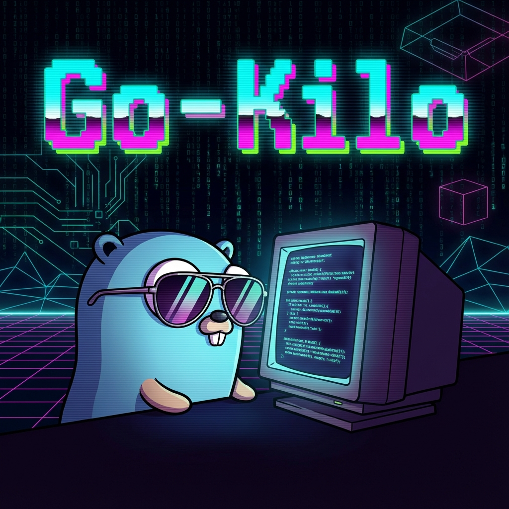

# Go-Kilo Editor



Go言語で実装するシンプルなターミナルテキストエディタ。このプロジェクトは、アンチリオスのkilo editorをGo言語で再実装することで、以下の学習目標を達成することを目指します。

## 学習目標

1. Go言語によるCLIアプリケーション開発の理解
2. 低レベルな端末制御の仕組みの理解
3. テキストエディタの基本的な仕組みの理解

## 実装予定の機能

- [x] Raw modeでの端末制御
- [x] 基本的なエディタ終了コマンド（Ctrl-C, Ctrl-Q）
- [x] エディタウィンドウのサイズ管理
- [x] 画面表示の基本実装（ちらつき防止、vim風の表示）
- [x] テキストの表示と編集
- [x] カーソル移動（矢印キー対応）
- [x] ステータスバー（ファイル名、位置情報、変更状態）
- [x] ファイルの保存（Ctrl-S）と読み込み
- [ ] 検索機能
- [ ] シンタックスハイライト

## プロジェクト構成

このプロジェクトは、Clean Architectureを意識した以下のディレクトリ構成になっています。

- `app/`
  - `boundary/`: 外部とのインターフェース（ファイル入出力、端末制御など）
  - `usecase/`: アプリケーション固有のビジネスロジック（エディタ操作、コマンド処理など）
  - `entity/`: ドメインオブジェクト（バッファ、カーソル、イベントなど）
- `main.go`: エントリーポイント

## 開発環境

- Go 1.21
- devcontainer環境で開発

## 使い方

```bash
go run .
```

### 基本コマンド

- `Ctrl-X` または `Ctrl-C`: エディタを終了
- `Ctrl-S`: ファイルを保存
- 矢印キー: カーソル移動

## アーキテクチャ設計方針

Clean Architectureに基づき、関心の分離と依存関係の整理を行っています。

1. **Entity (app/entity)**
   - アプリケーションのコアとなるデータ構造とドメインロジック
   - 外部への依存を持たない
   - 例: `Buffer`, `Cursor`, `Event`

2. **UseCase (app/usecase)**
   - アプリケーションのビジネスルールを実装
   - Entityを使用してユースケースを実現
   - Boundaryのインターフェースに依存
   - 例: `Editor`, `Controller`, `Command`

3. **Boundary (app/boundary)**
   - 外部システム（ファイルシステム、端末、OS）との境界
   - 具体的な実装詳細（`termbox-go`など）を隠蔽
   - 例: `FileManager`, `Terminal`

この構成により、テストの容易性、保守性、および将来的な機能拡張への柔軟性を確保しています。

## 参考

- [アンチリオスのkilo editor](https://viewsourcecode.org/snaptoken/kilo/)
- [Build Your Own Text Editor in C](https://viewsourcecode.org/snaptoken/kilo/index.html)