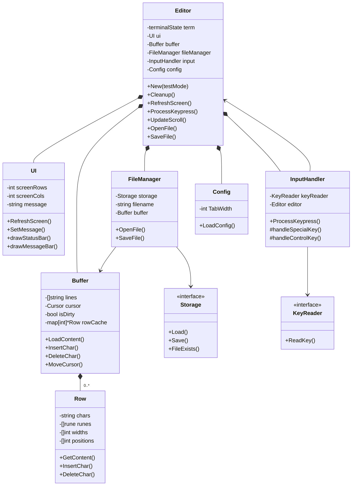

```mermaid
classDiagram
    class Editor {
        -terminalState term
        -UI ui
        -Buffer buffer
        -FileManager fileManager
        -InputHandler input
        -Config config
        +New(testMode)
        +Cleanup()
        +RefreshScreen()
        +ProcessKeypress()
        +UpdateScroll()
        +OpenFile()
        +SaveFile()
    }
    
    class Buffer {
        -[]string lines
        -Cursor cursor
        -bool isDirty
        -map[int]*Row rowCache
        +LoadContent()
        +InsertChar()
        +DeleteChar()
        +MoveCursor()
    }
    
    class UI {
        -int screenRows
        -int screenCols
        -string message
        +RefreshScreen()
        +SetMessage()
        +drawStatusBar()
        +drawMessageBar()
    }
    
    class FileManager {
        -Storage storage
        -string filename
        -Buffer buffer
        +OpenFile()
        +SaveFile()
    }
    
    class InputHandler {
        -KeyReader keyReader
        -Editor editor
        +ProcessKeypress()
        #handleSpecialKey()
        #handleControlKey()
    }
    
    class Config {
        -int TabWidth
        +LoadConfig()
    }
    
    class Row {
        -string chars
        -[]rune runes
        -[]int widths
        -[]int positions
        +GetContent()
        +InsertChar()
        +DeleteChar()
    }

    %% インターフェース
    class Storage {
        <<interface>>
        +Load()
        +Save()
        +FileExists()
    }

    class KeyReader {
        <<interface>>
        +ReadKey()
    }

    %% 依存関係
    Editor *-- UI
    Editor *-- Buffer
    Editor *-- FileManager
    Editor *-- InputHandler
    Editor *-- Config
    Buffer *-- "0..*" Row
    FileManager --> Storage
    FileManager --> Buffer
    InputHandler --> KeyReader
    InputHandler --> Editor
```
