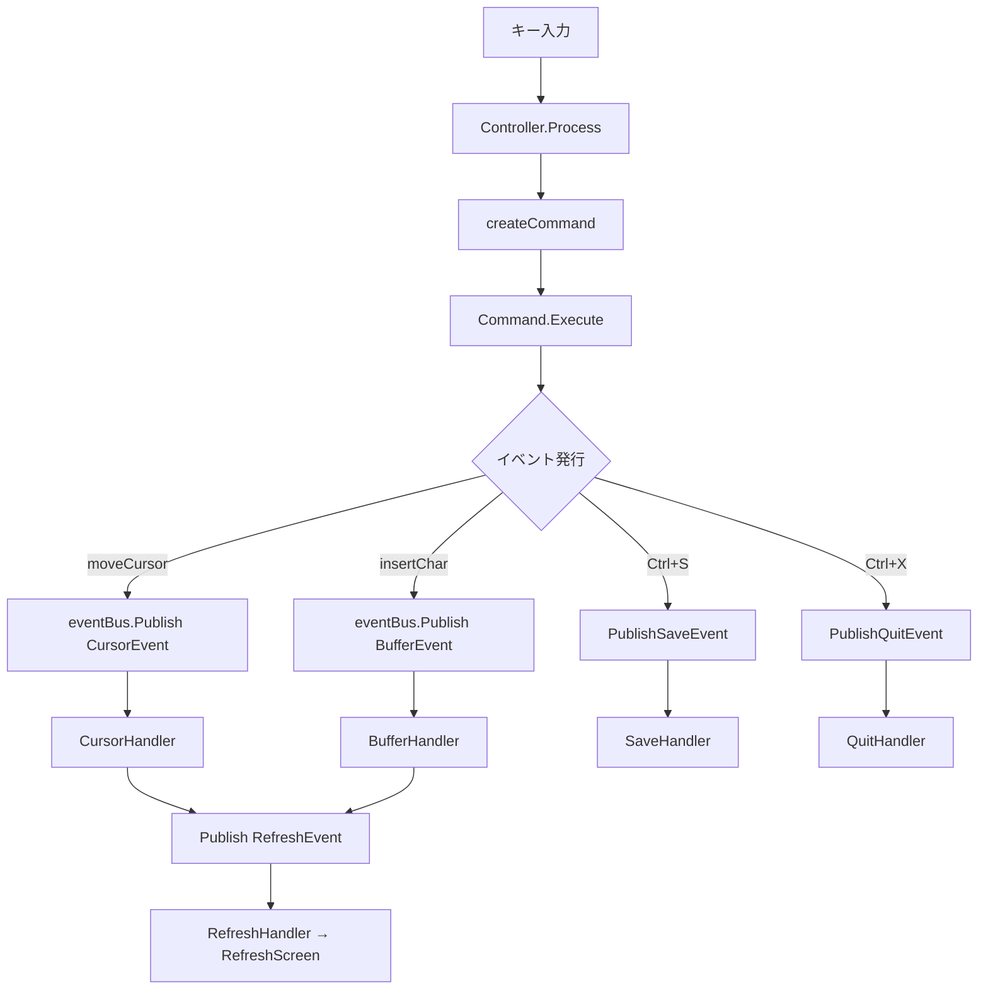

# イベント駆動型アーキテクチャ 実装状況レポート

## 調査結果サマリー

フェーズ1 (イベントシステム基盤) は**完了**済みで、フェーズ2 (コンポーネント移行) は**半ば完了**です。コマンドパターンがイベント発行をラップする「ブリッジ」構成で動作しており、完全なイベント駆動への移行は途中です。

## 実装済みコンポーネント

### イベント基盤 ✅

| ファイル | 内容 | 状態 |
|---|---|---|
| [event.go](file:///workspaces/go-kilo/app/entity/event/event.go) | 8種のEventType、5つのペイロード構造体、各種コンストラクタ | 完了 |
| [bus.go](file:///workspaces/go-kilo/app/entity/event/bus.go) | 非同期イベントバス (goroutine+channel)、同期モード、レスポンスチャネル | 完了 |
| [handler.go](file:///workspaces/go-kilo/app/entity/event/handler.go) | Handler interface、SingleTypeHandler、HandlerFunc | 完了 |

### イベントバスの機能

- `Subscribe` / `Publish` / `PublishAndWaitResponse`
- バッファ付きチャネル (100件)
- goroutineベースの非同期処理
- `SetSynchronous` テスト用同期モード
- `context.Context` によるシャットダウン制御

### コントローラー統合 (部分的) ✅

[controller.go](file:///workspaces/go-kilo/app/usecase/controller/controller.go) で以下5つのイベントハンドラが登録済み:

| イベント | ハンドラ | 動作 |
|---|---|---|
| `TypeSave` | `registerEventHandlers` 内 | ファイル保存 → ステータスメッセージ → 画面更新 |
| `TypeQuit` | `registerEventHandlers` 内 | ダーティチェック → 警告/終了 |
| `TypeCursor` | `createCursorHandler` | カーソル移動/セット → スクロール更新 → Refresh発行 |
| `TypeBuffer` | `createBufferHandler` | Insert/Delete/Newline → Refresh発行 |
| `TypeRefresh` | `createRefreshHandler` | `RefreshScreen()` 呼び出し |

## テスト結果 ✅

```
app/entity/event      — 9 tests ALL PASS (0.2s)
  BusBasicPublishSubscribe, BusPublishAndWaitResponse, BusDefaultHandler,
  BusMultipleHandlers, BusShutdown, NewEvent, NewSaveEvent, NewQuitEvent, NewResponseEvent

app/usecase/controller — イベント関連6 tests ALL PASS (0.3s)
  TestSaveEventHandling, TestSaveEventHandlingError,
  TestQuitEventHandlingClean, TestQuitEventHandlingDirty,
  TestQuitEventHandlingDirtyWarning, TestForceQuitEventHandling
```

## 現在のアーキテクチャ (ハイブリッド構成)



> [!IMPORTANT]
> **キー入力 → Command → Event という二重構造**になっています。`Process()` メソッドは依然として `createCommand()` でコマンドを生成し、その中でイベントを発行しています。

## 未実装・課題一覧

### 🔴 高優先度

| 課題 | 詳細 |
|---|---|
| **Command→Event二重構造の解消** | 現在コマンドがイベントをラップしているため、直接入力→イベント変換に移行すべき |
| **全テスト実行時のハング** | `go test ./app/...` がタイムアウト。特定テストは通るが全体実行でデッドロックの可能性 |
| **イベントバッチ処理のデバウンス** | `createRefreshHandler` のコメントに記載 — Phase 3以降で検討と明記 |

### 🟡 中優先度

| 課題 | 詳細 |
|---|---|
| **マウス入力のイベント化不完全** | マウスホイール/クリックは `createCommand` 内でコマンド生成 → その中でイベント発行 |
| **イベント優先順位制御** | ドキュメントに詳細な設計があるが未実装 |
| **エラー伝播の改善** | `EventError` 構造体等、設計済みだが未実装 |
| **キュー一元管理** | EventManagerとUI間でキューが分散している問題 |

### 🟢 低優先度 (フェーズ3)

| 課題 | 詳細 |
|---|---|
| プラグイン機構 | 未着手 |
| メモリプール | 設計のみ |
| パフォーマンスメトリクス | 設計のみ |
| イベントトレーシング | 設計のみ |

## 関連 Git コミット履歴

| コミット | 内容 |
|---|---|
| `ba4a337` | イベント駆動アーキテクチャの実装 (初期) |
| `b5139e2` | Controller file management + event tests |
| `f3ba2df` | 同期イベントバスモード + テストリファクタ |
| `2690065` | CursorSet movement + mutex安定化 |
| `a03a4ca` | quit sequence race condition修正 (最新) |

## 次のステップの提案

1. **全テストのハング問題の調査と修正** — `go test ./app/...` が通らないとCI/CDに支障
2. **Command層を除去してInput→Event直接変換** — `createCommand` を `createEvent` に置換
3. **RefreshEventのデバウンス実装** — 連続更新の最適化
4. **ドキュメント (`event_driven_architecture.md`) の進捗反映** — 現状と乖離している箇所を更新
