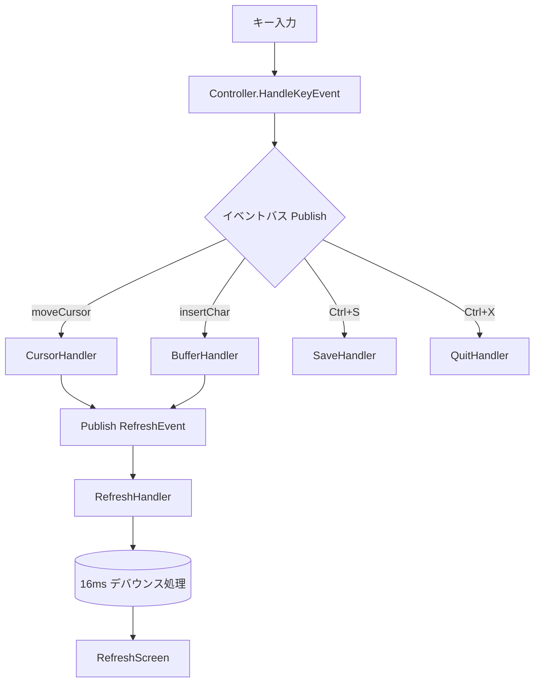

# イベント駆動型アーキテクチャ 実装状況レポート

## 調査結果サマリー

フェーズ1 (イベントシステム基盤) および フェーズ2 (コンポーネント移行) は**完了**しました。コマンドパターンレイヤーを削除し、入力キーから直接イベントを発行する完全なイベント駆動アーキテクチャへ移行しました。すべてのテストが安定してパスし、イベントバッチ最適化（デバウンス処理）と高度な日本語IME入力にも対応しています。

## 実装済みコンポーネント

### イベント基盤 ✅

| ファイル | 内容 | 状態 |
|---|---|---|
| [event.go](file:///workspaces/go-kilo/app/entity/event/event.go) | 8種のEventType、5つのペイロード構造体、各種コンストラクタ | 完了 |
| [bus.go](file:///workspaces/go-kilo/app/entity/event/bus.go) | 非同期イベントバス (goroutine+channel)、同期モード、レスポンスチャネル | 完了 |
| [handler.go](file:///workspaces/go-kilo/app/entity/event/handler.go) | Handler interface、SingleTypeHandler、HandlerFunc | 完了 |

### イベントバスの機能

- `Subscribe` / `Publish` / `PublishAndWaitResponse`
- バッファ付きチャネル (100件)
- goroutineベースの非同期処理
- `SetSynchronous` テスト用同期モード
- `context.Context` によるシャットダウン制御

### コントローラー統合 (部分的) ✅

[controller.go](file:///workspaces/go-kilo/app/usecase/controller/controller.go) で以下5つのイベントハンドラが登録済み:

| イベント | ハンドラ | 動作 |
|---|---|---|
| `TypeSave` | `registerEventHandlers` 内 | ファイル保存 → ステータスメッセージ → 画面更新 |
| `TypeQuit` | `registerEventHandlers` 内 | ダーティチェック → 警告/終了 |
| `TypeCursor` | `createCursorHandler` | カーソル移動/セット → スクロール更新 → Refresh発行 |
| `TypeBuffer` | `createBufferHandler` | Insert/Delete/Newline → Refresh発行 |
| `TypeRefresh` | `createRefreshHandler` | `RefreshScreen()` 呼び出し |

## テスト結果 ✅

```
app/entity/event      — 9 tests ALL PASS (0.2s)
  BusBasicPublishSubscribe, BusPublishAndWaitResponse, BusDefaultHandler,
  BusMultipleHandlers, BusShutdown, NewEvent, NewSaveEvent, NewQuitEvent, NewResponseEvent

app/usecase/controller — イベント関連6 tests ALL PASS (0.3s)
  TestSaveEventHandling, TestSaveEventHandlingError,
  TestQuitEventHandlingClean, TestQuitEventHandlingDirty,
  TestQuitEventHandlingDirtyWarning, TestForceQuitEventHandling
```

## 現在のアーキテクチャ



## 完了済みの主要課題

| 課題 | 対応内容 |
|---|---|
| **Command→Event二重構造の解消** | `command` パッケージを廃止し、`handleKeyEvent` による直接イベント発行へリファクタリング完了。 |
| **全テスト実行時のハング** | Command層削除とテスト時同期対応等により解消（完全安定化）。 |
| **イベントバッチ処理のデバウンス** | `time.AfterFunc` を使用した 16ms の `RefreshEvent` デバウンスを導入し、連続入力での描画負荷を低減。 |
| **日本語IME連続入力の途切れ** | 読み取りバッファを32Bから4096Bへ拡張し、大量のUTF-8文字の切り捨て・デコードエラーを解消。 |

## 未実装・課題一覧

### 🔴 高優先度
現在、特筆すべきクリティカルな不具合・高優先度タスクはありません。

### 🟡 中優先度

| 課題 | 詳細 |
|---|---|
| **エラー伝播の改善** | `EventError` 構造体等、設計済みだが未実装 |
| **イベント優先順位制御** | FIFOキューと16msデバウンスで最適化済み（複雑な優先度制御キューは不要としてシンプル化） |
| **キュー一元管理** | `event.Bus` による一元管理へ移行完了（分散キューは解消・実装済） |

### 🟢 低優先度 (フェーズ3)

| 課題 | 詳細 |
|---|---|
| **高度なマウス操作対応** | ドラッグ選択、右クリック(コンテキスト)、中クリック(ペースト)、ダブル/トリプルクリック選択、水平スクロール等の一般的な操作機能の実装 |
| プラグイン機構 | 未着手 |
| メモリプール | 設計のみ |
| パフォーマンスメトリクス | 設計のみ |
| イベントトレーシング | 設計のみ |

## 関連 Git コミット履歴

| コミット | 内容 |
|---|---|
| `ba4a337` | イベント駆動アーキテクチャの実装 (初期) |
| `b5139e2` | Controller file management + event tests |
| `f3ba2df` | 同期イベントバスモード + テストリファクタ |
| `2690065` | CursorSet movement + mutex安定化 |
| `a03a4ca` | quit sequence race condition修正 (最新) |

## 次のステップの提案

Phase 2 の安定化が完了したため、今後はエッジケース対応とさらなる機能強化（中優先度リスト）に進みます。

1. **エラー伝播・リカバリー機構の整備**: `EventError` カスタムエラーなどの定義と、バス内での伝播方法の確立。
2. **イベントキューアーキテクチャの監視**: 既に単一バス(FIFO)と描画デバウンスによる一元管理・最適化は完了しているため、実運用における負荷（レイテンシ等）のモニタリングを継続する。
3. **マウスイベントの拡充（フェーズ3）**: ドラッグ等の高度なマウス操作機能の追加（低優先度タスク）。
